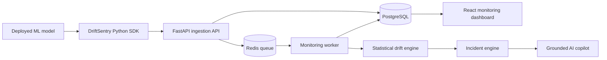

# DriftSentry AI

**Production ML monitoring and an evidence-grounded incident copilot.**

DriftSentry collects prediction telemetry from deployed classification models, compares production windows with a reference profile, detects data and performance drift, and creates incidents supported by reproducible statistical evidence.

> Project status: **Day 2 — model registry**. PostgreSQL migrations, secure model registration, feature schemas, and API tests are implemented.

## Why this project exists

A model can keep returning HTTP 200 responses while becoming unreliable. Input distributions change, unseen categories appear, missing values increase, and model quality silently deteriorates. DriftSentry makes those failures visible.

## MVP capabilities

- Register a binary-classification model and feature schema
- Ingest prediction events through an HTTP API and Python SDK
- Build a reference profile from training data
- Compare rolling production windows with the reference
- Detect schema, missingness, numerical, categorical, prediction, and performance drift
- Create severity-ranked incidents with supporting metric evidence
- Produce AI-assisted incident reports whose citations are programmatically validated
- Benchmark the detector with controlled drift-injection scenarios

## Architecture



The detailed design is in [`docs/ARCHITECTURE.md`](docs/ARCHITECTURE.md).

## Repository structure

```text
driftsentry-ai/
├── backend/               FastAPI API and monitoring engine
├── frontend/              React and TypeScript dashboard
├── sdk/                   Python telemetry SDK (Day 3)
├── docs/                  Product, architecture, and learning notes
├── compose.yaml           Local development services
├── .env.example           Safe configuration template
└── Makefile               Common development commands
```

## Quick start with Docker

Requirements: Docker Desktop or Docker Engine with Compose.

```bash
cp .env.example .env
docker compose up --build
```

Then open:

- Dashboard: http://localhost:5173
- API documentation: http://localhost:8000/docs
- Liveness check: http://localhost:8000/api/v1/health/live
- Dependency readiness: http://localhost:8000/api/v1/health/ready

Stop the stack with:

```bash
docker compose down
```

Use `docker compose down -v` only when you intentionally want to delete the local database.

## Backend development without Docker

PostgreSQL and Redis still need to be available, but the liveness endpoint and unit tests do not require either service.

```bash
cd backend
python -m venv .venv
# Linux/macOS: source .venv/bin/activate
# Windows PowerShell: .venv\Scripts\Activate.ps1
pip install -e ".[dev]"
uvicorn driftsentry_api.main:app --reload
```

Run quality checks:

```bash
pytest
ruff check .
ruff format --check .
mypy src
```

## Frontend development

```bash
cd frontend
npm install
npm run dev
```

Vite proxies browser requests beginning with `/api` to the backend, so browser code never needs a hard-coded backend URL.

## Delivery roadmap

- [x] Product specification and architecture
- [x] Monorepo and development environment
- [x] Liveness and dependency-readiness API
- [ ] Model registry and database migrations
- [ ] Prediction ingestion API
- [ ] Python telemetry SDK
- [ ] Reference profiler
- [ ] Drift detection engine
- [ ] Monitoring worker and incidents
- [ ] Dashboard visualizations
- [ ] Delayed-label performance monitoring
- [ ] Grounded AI incident copilot
- [ ] Drift-injection benchmark
- [ ] CI/CD, deployment, documentation, and demo

## Documentation

- [`PRODUCT_SPEC.md`](docs/PRODUCT_SPEC.md) — users, scope, requirements, and success criteria
- [`ARCHITECTURE.md`](docs/ARCHITECTURE.md) — components, data flow, and engineering decisions
- [`DATA_MODEL.md`](docs/DATA_MODEL.md) — proposed relational data model
- [`LEARNING_PATH.md`](docs/LEARNING_PATH.md) — concepts to study and explain in interviews
- [`DAY_01_CHECKPOINT.md`](docs/DAY_01_CHECKPOINT.md) — setup, study order, and knowledge check

## Guiding principle

**The LLM is not the monitoring system.** Statistical code detects and measures failures. The LLM receives a constrained evidence package and turns it into an understandable investigation report.
