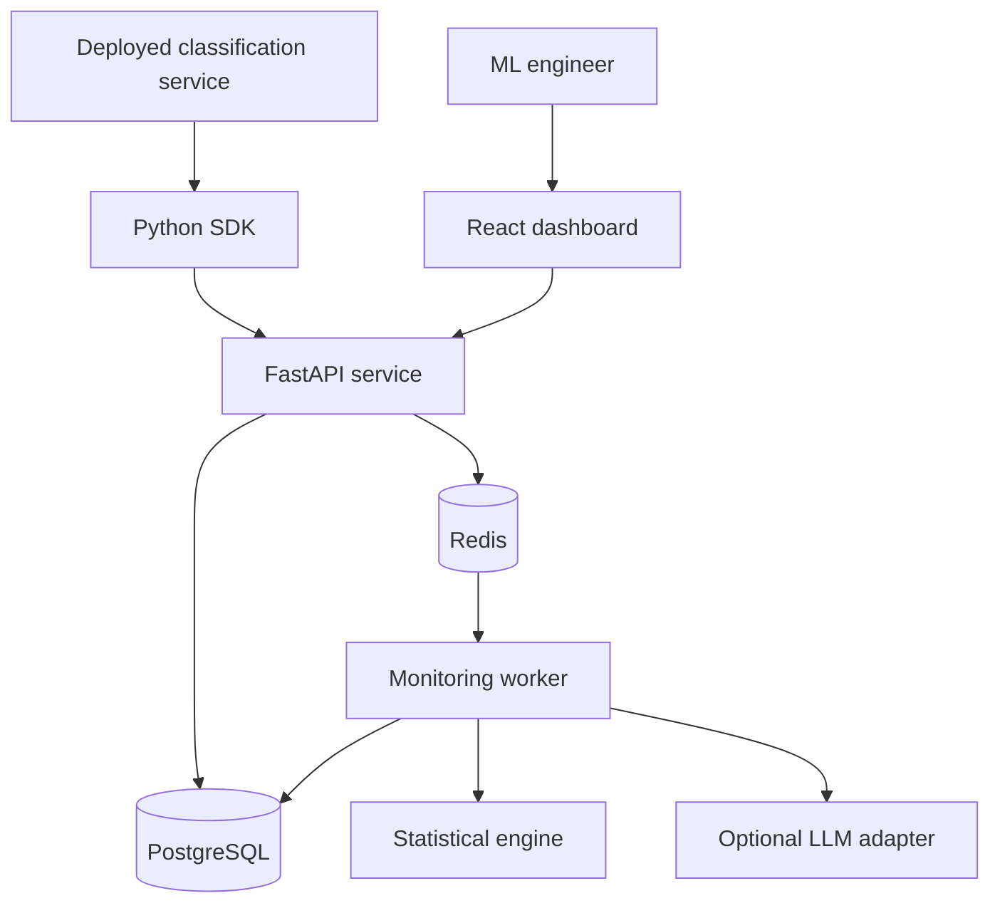
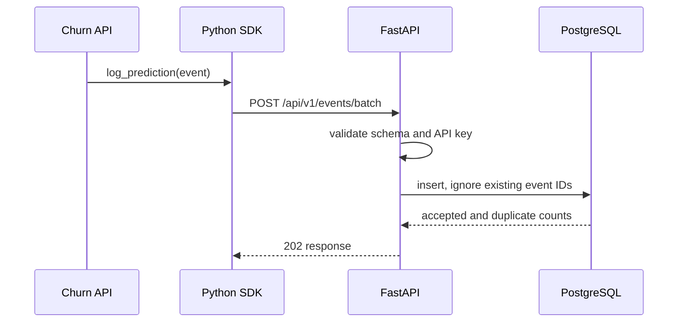
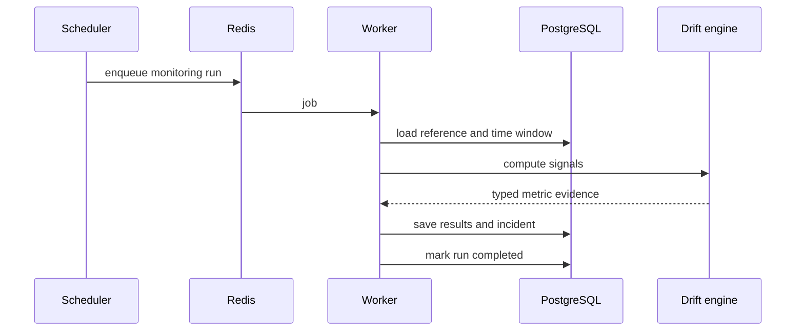

# DriftSentry AI — Architecture

## 1. System context

## 2. Runtime components

### React dashboard

Responsibilities:

- model and reference-profile management;
- drift visualizations;
- monitoring-run and incident views;
- delayed-label performance charts;
- benchmark results.

The browser calls relative `/api/...` URLs. During local development, Vite proxies those requests to FastAPI.

### FastAPI service

Responsibilities:

- request validation;
- model registry APIs;
- idempotent telemetry ingestion;
- querying monitoring results and incidents;
- submitting long-running jobs;
- authentication of ingestion clients.

The API should not run expensive profiling or drift calculations inside ingestion requests.

### PostgreSQL

System of record for model metadata, feature schemas, prediction events, labels, reference profiles, monitoring runs, evidence, and incidents.

JSONB is used for flexible feature payloads and metric evidence. Frequently filtered fields remain normal indexed columns.

### Redis and worker

Redis transports background jobs. The worker performs reference profiling, monitoring runs, benchmark scenarios, and report generation.

A job must be safe to retry. Monitoring runs use unique identifiers and explicit status transitions to prevent duplicate results.

### Statistical engine

Implemented as framework-independent Python functions where possible. It receives reference/current arrays or profiles and returns typed results. Pure functions make numerical behavior easier to test.

Initial signals:

- schema compatibility;
- missing-rate difference;
- numerical PSI and KS statistic;
- categorical Jensen–Shannon divergence and unseen-category rate;
- prediction and confidence drift;
- labelled performance changes.

A p-value alone does not determine severity. Sample size and effect magnitude are also required.

### AI incident copilot

The copilot receives a compact evidence package, never an unrestricted database connection. Output is validated against a Pydantic schema. A post-processing validator rejects citation IDs absent from the evidence package.

The deterministic fallback renders the same evidence without an external API.

## 3. Main data flow

### Prediction ingestion

### Monitoring run

## 4. API conventions

- All application routes begin with `/api/v1`.
- UUIDs identify externally visible resources.
- Timestamps are ISO 8601 UTC.
- Errors use a stable machine-readable code plus human-readable detail.
- Batch ingestion returns accepted, duplicate, and rejected counts.
- Expensive work returns `202 Accepted` and a run resource to poll.

## 5. Reliability decisions

### Idempotency

The SDK provides an event ID. A database unique constraint on `(model_id, event_id)` makes retries safe.

### Monitoring run lifecycle

`pending → running → completed | failed`

A failed run records a safe error summary and can be retried without overwriting previous evidence.

### Readiness versus liveness

- Liveness means the API process can serve requests.
- Readiness means required dependencies such as PostgreSQL and Redis are reachable.

These are intentionally separate endpoints.

## 6. Security and privacy

- Ingestion keys are stored as hashes, not plaintext.
- API keys and provider secrets are loaded from environment variables.
- Raw production feature rows are never included in LLM prompts.
- Logs avoid full feature payloads.
- Request size and batch length will be bounded.
- The demo uses public or generated data and no personal information.

## 7. Deployment shape

The local environment uses Docker Compose. A public demo can deploy the frontend, API, worker, PostgreSQL, and Redis separately. The architecture deliberately avoids depending on Docker Compose semantics in application code.

## 8. Key architectural trade-offs

| Decision | Reason | Cost |
|---|---|---|
| PostgreSQL instead of a time-series database | Simpler MVP and strong relational consistency | Large-scale analytical queries would later need partitioning/OLAP storage |
| Redis worker instead of Kafka | Appropriate for scheduled jobs and two-week scope | Not intended for massive event streaming |
| JSONB feature payloads | Supports varying model schemas | Requires careful indexing and validation |
| React/Vite instead of Next.js | Dashboard does not need SSR; faster learning/build cycle | No built-in server framework |
| In-house metrics instead of only wrapping Evidently | Demonstrates statistical understanding and testability | More implementation responsibility |
| Optional LLM | Core monitoring works without keys or cost | Deterministic fallback is less conversational |
