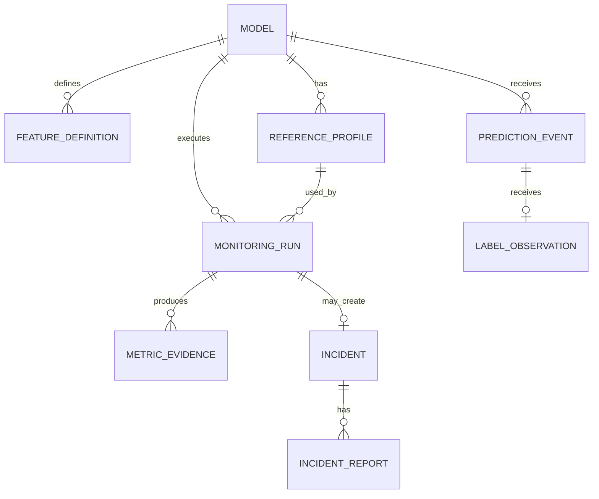

# DriftSentry AI — Proposed Data Model

The model is intentionally scoped to a single local workspace for the MVP. Multi-tenancy can later add `workspace_id` to top-level resources.

## Entity relationship overview

## Tables

### `models`

| Column | Type | Notes |
|---|---|---|
| `id` | UUID | Primary key |
| `name` | text | Human-readable name |
| `version` | text | Version supplied by user |
| `task_type` | enum | `binary_classification` in MVP |
| `status` | enum | `active`, `paused`, `archived` |
| `ingestion_key_hash` | text | Never store plaintext key |
| `monitoring_config` | JSONB | Threshold and window configuration |
| `created_at` | timestamptz | UTC |

Unique constraint: `(name, version)`.

### `feature_definitions`

| Column | Type | Notes |
|---|---|---|
| `id` | UUID | Primary key |
| `model_id` | UUID | Foreign key |
| `name` | text | Feature name |
| `data_type` | enum | `numerical`, `categorical`, `boolean` |
| `nullable` | boolean | Schema expectation |
| `constraints` | JSONB | Optional min/max/allowed values |

Unique constraint: `(model_id, name)`.

### `prediction_events`

| Column | Type | Notes |
|---|---|---|
| `id` | UUID | Internal primary key |
| `model_id` | UUID | Foreign key |
| `event_id` | text | Client-generated idempotency ID |
| `occurred_at` | timestamptz | Inference time |
| `features` | JSONB | Validated input values |
| `prediction` | integer | `0` or `1` |
| `probability` | double precision | Positive-class probability |
| `created_at` | timestamptz | Ingestion time |

Unique constraint: `(model_id, event_id)`.

Initial indexes: `(model_id, occurred_at)` and a unique index on `(model_id, event_id)`.

### `label_observations`

| Column | Type | Notes |
|---|---|---|
| `id` | UUID | Primary key |
| `prediction_event_id` | UUID | Unique foreign key |
| `actual` | integer | `0` or `1` |
| `observed_at` | timestamptz | When ground truth became available |

### `reference_profiles`

| Column | Type | Notes |
|---|---|---|
| `id` | UUID | Primary key |
| `model_id` | UUID | Foreign key |
| `name` | text | e.g. `training-2026-08` |
| `row_count` | integer | Profiled records |
| `profile` | JSONB | Typed summary statistics |
| `algorithm_version` | text | Supports reproducibility |
| `is_active` | boolean | One active profile per model |
| `created_at` | timestamptz | UTC |

### `monitoring_runs`

| Column | Type | Notes |
|---|---|---|
| `id` | UUID | Primary key |
| `model_id` | UUID | Foreign key |
| `reference_profile_id` | UUID | Foreign key |
| `window_start` | timestamptz | Inclusive |
| `window_end` | timestamptz | Exclusive |
| `status` | enum | `pending`, `running`, `completed`, `failed` |
| `config_snapshot` | JSONB | Exact thresholds used |
| `summary` | JSONB | Counts and maximum severity |
| `started_at` | timestamptz | Nullable |
| `completed_at` | timestamptz | Nullable |
| `error_code` | text | Safe machine-readable failure reason |

### `metric_evidence`

| Column | Type | Notes |
|---|---|---|
| `id` | UUID | Stable citation ID |
| `run_id` | UUID | Foreign key |
| `feature_name` | text | Nullable for model-level metrics |
| `metric_name` | text | e.g. `psi`, `missing_rate_delta` |
| `value` | double precision | Main result |
| `threshold` | double precision | Applied threshold |
| `status` | enum | `pass`, `warning`, `fail`, `insufficient_data` |
| `severity` | enum | `none`, `low`, `medium`, `high`, `critical` |
| `evidence` | JSONB | Counts, reference/current values, p-values, bins |

### `incidents`

| Column | Type | Notes |
|---|---|---|
| `id` | UUID | Primary key |
| `model_id` | UUID | Foreign key |
| `run_id` | UUID | Unique foreign key |
| `title` | text | Deterministic initial title |
| `severity` | enum | Highest grouped severity |
| `status` | enum | `open`, `acknowledged`, `resolved` |
| `created_at` | timestamptz | UTC |
| `resolved_at` | timestamptz | Nullable |

### `incident_reports`

| Column | Type | Notes |
|---|---|---|
| `id` | UUID | Primary key |
| `incident_id` | UUID | Foreign key |
| `generator` | text | `deterministic`, `groq`, `gemini`, etc. |
| `model_name` | text | Nullable for deterministic reports |
| `report` | JSONB | Validated structured report |
| `citations_valid` | boolean | Post-generation validation result |
| `created_at` | timestamptz | UTC |

## Retention decision

The MVP retains raw demo events. A production version would support configurable retention and long-term aggregate profiles so sensitive raw features can be deleted.
